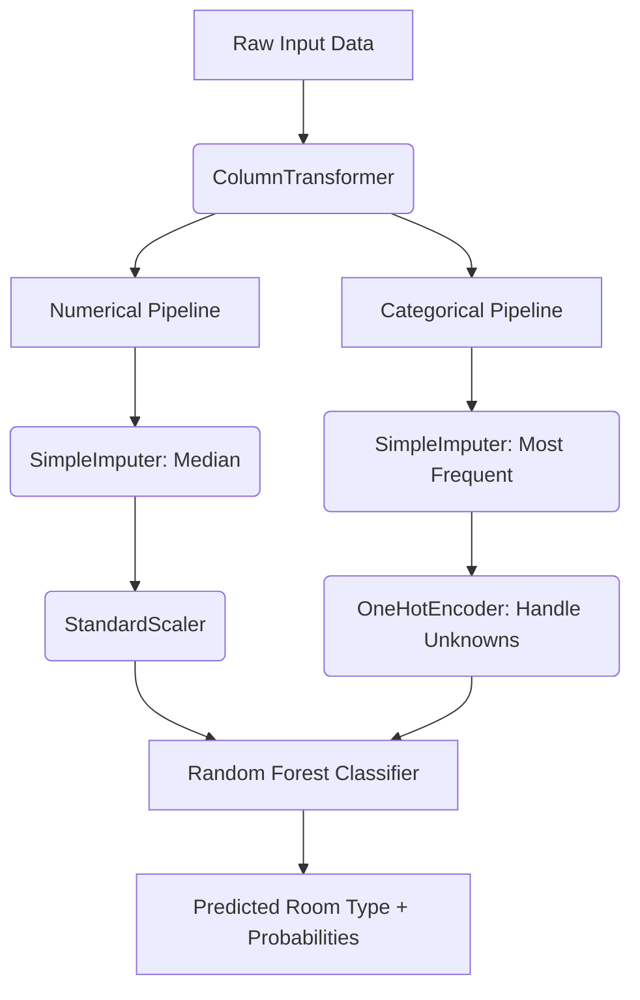

# NYC Airbnb Room Type Classifier 🚀

A premium, interactive web application and machine learning pipeline that classifies New York City Airbnb listings into their respective housing/room types (`Entire home/apt`, `Private room`, or `Shared room`) based on historical NYC Airbnb dataset attributes.

The project features a **Scikit-Learn Random Forest pipeline** served via a **FastAPI backend** and a **responsive, glassmorphic dashboard UI** utilizing vanilla HTML, CSS, and JavaScript.

🔗 **Live Demo:** [https://ml-newyorkdatahousingtype-classification.onrender.com](https://ml-newyorkdatahousingtype-classification.onrender.com)

---

## 📋 Table of Contents
1. [Project Overview](#-project-overview)
2. [Key Features](#-key-features)
3. [Technology Stack](#-technology-stack)
4. [Dataset & Model Pipeline](#-dataset--model-pipeline)
5. [Project Architecture](#-project-architecture)
6. [Getting Started](#-getting-started)
   - [Prerequisites](#prerequisites)
   - [Installation](#installation)
   - [Running the Application](#running-the-application)
7. [API Endpoint Documentation](#-api-endpoint-documentation)
8. [UI Features](#-ui-features)
9. [License](#-license)

---

## 🔍 Project Overview

Understanding Airbnb room types is crucial for price modeling, real estate insights, and platform optimization. This project predicts the classification of a listing using properties such as:
- Geolocation coordinates (Latitude/Longitude)
- Price per night
- Host activity (listing count, availability)
- Booking requirements (minimum nights)
- Popularity (number of reviews, reviews per month)
- Specific location details (Borough group and neighborhood name)

---

## ✨ Key Features

- **End-to-End Machine Learning Pipeline:** Preprocessing (imputing, scaling, and one-hot encoding) is coupled with a Random Forest model in a single serialized pipeline (`Model_Pipeline.pkl`).
- **Class Imbalance Handling:** Uses a `balanced` class weight configuration to ensure the model is robust against minority classes like `Shared room`.
- **FastAPI Backend:** A lightweight, high-performance API server with input request validation using Pydantic schemas.
- **Glassmorphic Dashboard UI:** A visually stunning frontend containing interactive forms, sliders, dynamic neighborhood autocomplete dropdowns, real-time prediction bars, and animated transitions.
- **Responsive Layout:** Optimized for all screen sizes, from mobile devices to high-resolution desktops.

---

## 🛠️ Technology Stack

### Backend & Model Serving
- **Python 3.8+**
- **FastAPI:** Modern, fast web framework for building APIs.
- **Pydantic:** Data validation and settings management.
- **Uvicorn:** ASGI web server implementation.
- **Pandas:** Data manipulation and analysis.
- **Joblib:** Serialized model persistence.

### Frontend
- **HTML5 & CSS3:** Semantic markup and modern styling including custom CSS grids, flexbox, glassmorphic blur effects, linear gradients, and micro-animations.
- **JavaScript (ES6):** Async fetch requests, custom autocomplete search, form validation, and reactive UI state management.
- **FontAwesome & Google Fonts:** Integrated premium icons and custom typography (Outfit and Plus Jakarta Sans).

### Machine Learning
- **Jupyter Notebook:** For exploratory data analysis (EDA), model experimentation, hyperparameter tuning, and model export.
- **Scikit-Learn:** Built-in estimators, estimators comparison (`DecisionTreeClassifier`, `RandomForestClassifier`, `GradientBoostingClassifier`), and parameter tuning with `RandomizedSearchCV`.

---

## 📊 Dataset & Model Pipeline

The machine learning model is trained on NYC Airbnb data. The pipeline is structured as follows:



### Model Performance Metrics
- **Hyperparameter Optimization:** Conducted using `RandomizedSearchCV` across estimators like Decision Trees, Random Forests, and Gradient Boosting.
- **Grid CV Accuracy Score:** `0.733`
- **Final Test Accuracy:** `0.855` (85.50% classification accuracy on the unseen test set).

---

## 📁 Project Architecture

```
ML_HouseTypeClassificationModel/
│
├── static/                     # Frontend Assets
│   ├── index.html              # Main dashboard UI structure
│   ├── style.css               # Glassmorphic custom styling & animations
│   └── script.js               # Auto-complete logic, fetch requests, UI states
│
├── Model_Pipeline.pkl          # Exported Scikit-Learn Model Pipeline
├── NewYorkDataHousingType.ipynb # Data Analysis, Preprocessing & Training notebook
├── categories.json             # Map of valid boroughs and neighborhoods
├── main.py                     # FastAPI backend application
├── requirements.txt            # Python package dependencies
└── README.md                   # Project documentation (this file)
```

---

## 🚀 Getting Started

### Prerequisites
- Python 3.8 or higher installed on your system.

### Installation

1. Clone or download this repository to your local machine:
   ```bash
   git clone <repository-url>
   cd ML_HouseTypeClassificationModel
   ```

2. Create a virtual environment:
   ```bash
   python -m venv venv
   ```

3. Activate the virtual environment:
   - **On Windows (PowerShell):**
     ```powershell
     .\venv\Scripts\Activate.ps1
     ```
   - **On macOS/Linux:**
     ```bash
     source venv/bin/activate
     ```

4. Install the required dependencies:
   ```bash
   pip install -r requirements.txt
   ```

### Running the Application

1. Start the FastAPI backend server:
   ```bash
   uvicorn main:app --reload
   ```

2. Open your web browser and navigate to:
   [http://127.0.0.1:8000](http://127.0.0.1:8000)

---

## 🔌 API Endpoint Documentation

### **1. Serve Frontend UI**
- **Endpoint:** `GET /`
- **Description:** Returns the main HTML interface.

### **2. Serves Static Files**
- **Endpoint:** `GET /static/{file_path}`
- **Description:** Resolves and serves stylesheet, client javascript, or visual assets.

### **3. Predict Room Type**
- **Endpoint:** `POST /predict`
- **Description:** Accepts listing parameters and returns classification prediction with probabilities.

#### **Request Body Schema (`application/json`):**
```json
{
  "latitude": 40.7128,
  "longitude": -74.0060,
  "price": 150.0,
  "minimum_nights": 2,
  "number_of_reviews": 25,
  "reviews_per_month": 1.5,
  "calculated_host_listings_count": 1,
  "availability_365": 180,
  "neighbourhood_group": "Manhattan",
  "neighbourhood": "Harlem"
}
```

#### **Response Body Schema (`application/json`):**
```json
{
  "Predicted_room_type": "Entire home/apt",
  "Probability": [
    0.852,
    0.141,
    0.007
  ]
}
```
*(Order of indices in `Probability` corresponds to the alphabetized classes: `Entire home/apt`, `Private room`, `Shared room`)*

---

## 🎨 UI Features

- **Interactive Coordinate Boundaries:** Validates latitude/longitude input against real NYC geographical bounds (Latitude: `40.49` to `40.92`, Longitude: `-74.25` to `-73.70`).
- **Dynamic Autocomplete Dropdowns:** Selecting a borough group dynamically filters the list of available neighborhoods. Users can search and select neighborhood names instantly.
- **Dual price input:** Syncs numerical price fields with a visual slider.
- **Prediction Visualization:** Renders interactive, colored status bars indicating the confidence percentage of each classification category.
- **Asynchronous States:** Seamlessly transitions UI between welcome cards, loading indicators, API error handlers, and prediction summaries.

---

## 📄 License
This project is open-source and available under the MIT License.
